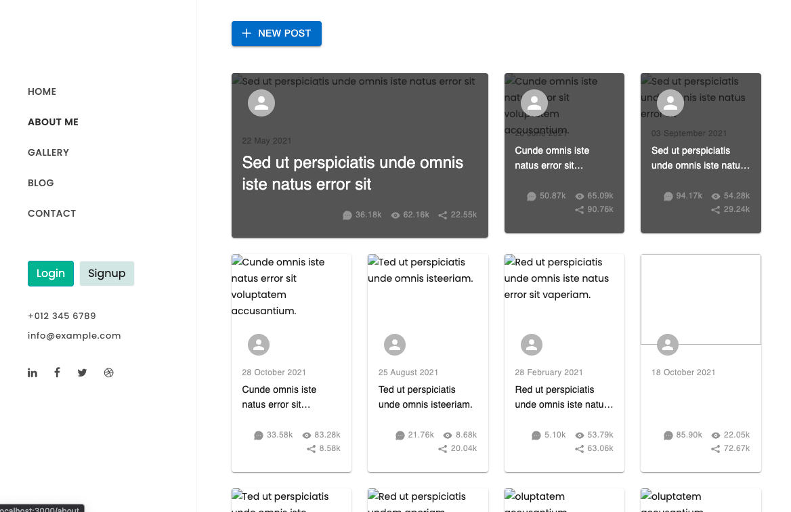

# Grenfell-Racing

## Table of Contents
- [Description](#description)
- [Installation](#installation)
- [Usage](#usage)
- [Credits](#credits)
- [License](#license)

## Description
A website that allows you to update postd, profile and images without having to know how to code or spend the money on website build sites. 

## Installation
Either clone or down the repository and run the command `npm i` to install the dependencies for the project. 

Once this has complete, enter `npm run build` this will allow the application to build and finally enter `npm run develop` this will allow both the front end and back end server to run concurrently.

## Usage
The application is straightforward to use.
A user can search for any book to see if it is in the database.
To save books the user must sign up with a username, email and password and be logined in.

## Credits
This project idea is part of the [Adelaide University Coding Boot Camp](https://bootcamps.adelaide.edu.au).

## License
This project is released under the [MIT License](LICENSE)